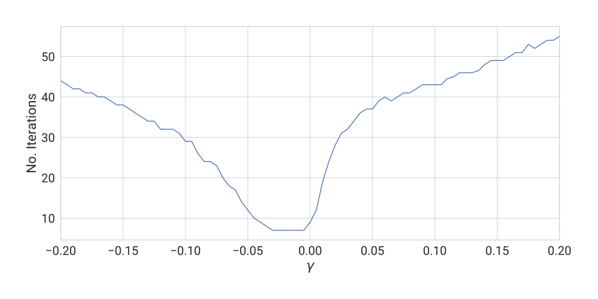

# A Symmetric Relative-Error Loss Function for Intermittent Multiscale Signal Modelling

This repository contains all the code used to generate the results presented at the 34th International Joint Conference on Artificial Intelligence, as well as the supplementary material not included in the main manuscript.

## Usage

To be able to run the code in this repository, please create and activate the included [Conda](https://anaconda.org/) virtual environment using the following commands:

```shell
conda env create -f environment.yml
conda activate keras_jax
```

## Contents

- Libraries
  - `loss_functions.py`: Contains the auxiliary `Keras.Loss` subclasses used to parallelize the experimental pipeline.
  - `sku_models.py`: Contains the model definitions for the first experiment in the manuscript (SKU demand forecasting).
  - `pv_utils.py`: Contains the dataset utilities for the second experiment in the manuscript (PV consumption forecasting).
- Scripts
  - `smaspe_plot.py`: Generates the figures for the Introduction and Analysis sections of the manuscript.
  - `sku.ipynb` (notebook): Generates the results for the first experiment.
  - `pv_generation.py`: Generates the results for the second experiment.
  - `sensitivity_analysis.py`: Generates the results for the [sensitivity analysis of the relaxation coefficient](#sensitivity-analysis-relaxation-coefficient).

## Supplementary Material

### Proof: Smoothness of the Arctangent of a Square

Let $f(x) \coloneqq \arctan{x^2}$. Then, its first derivative is given by
$$
\frac{df}{dx}(x) = \left. \frac{d}{du}\left(\arctan{u}\right) \right|_{u=x^2} \frac{d}{dx}\left( x^2 \right)  = \frac{2x}{x^4+1} = \frac{p_1(x)}{q_1(x)},
$$
where $p_1$ and $q_1$ are the polynomials defining the quotient that defines the first-order derivative. From the above expression, the following can be stated:

- Since $x^4+1 \neq 0 \quad \forall x \in  (-\infty, \infty)$, there is no finite value of $x$ for which the first derivative is not finite.
- Since $1 = deg(p_1) < deg(q_1) = 4$, the limit of the derivative as $x \rightarrow \pm \infty$ is 0.

Thus, $\arctan{x^2}$ is proven to be $C^1 \, \forall x \in \mathbb{R}$.

Now, using the quotient rule, the second derivative can be written in terms of the polynomials $p_1$ and $q_1$ to form a new quotient; namely
$$
\begin{split}
    \frac{d^2f}{dx^2}(x)
        & = \frac{d}{dx}\left( \frac{df}{dx}(x) \right)
    = \frac{d}{dx}\left(\frac{p_1(x)}{q_1(x)}\right)
    \\
        & = \frac{p_1'(x) q_1(x) - p_1(x) q_1'(x)}{\left(q_1(x)\right)^2}  = \frac{- 6x^4 + 2}{(x^4 + 1)^2}
    = \frac{p_2(x)}{q_2(x)} .
\end{split}
$$

By induction, the derivative of degree $n+1$ can be written as a recursion of the form
$$
\begin{split}
    \frac{d^{n+1}f}{dx^{n+1}}(x)
        & = \frac{d}{dx}\left( \frac{d^nf}{dx^n}(x) \right)
    = \frac{d}{dx}\left(\frac{p_n(x)}{q_n(x)}\right)
    \\
        & = \frac{p_n'(x) q_n(x) - p_n(x) q_n'(x)}{\left(q_n(x)\right)^2}
    = \frac{p_{n+1}(x)}{q_{n+1}(x)}
\end{split}
$$
for all $n \ge 1$.

It is easy to see that $q_n$ is given by $q_1$ elevated to a non-negative power of 2; namely, $$ q_n(x) = q_1(x)^{2^{n-1}} = (x^4+1)^{2^{n-1}} \quad \forall n \in \mathbb{Z}^+ .$$

Since $\nexists x \in (-\infty, \infty), n \in \mathbb{Z}^+$ for which $q_n(x)$ is zero, there is no finite value of $x$ for which the $n^{th}$ derivative is not finite.

Furthermore, the degree dominating these polynomials can also be expressed as a function of their predecessors: let $P_n$ and $Q_n$ denote the maximum degrees of the polynomials $p_n$ and $q_n$, respectively; then, using the polynomial recursions defined earlier, these can be rewritten as a recursive system of equations of the form
$$
\begin{cases}
    P_{n+1} & = P_n + Q_n - 1,
    \\
    Q_{n+1} & = 2 Q_n.
\end{cases}
$$

To express this system of equations purely in terms of $n$, the first few terms of the recursion are expanded as
$$
\begin{split}
    n = 2 \implies & \begin{cases}
                         P_2 & = 1 + 4 - 1                     \\
                             & = (2^0 + 2^1 + 2^2 - 2^1) - 1 , \\
                         Q_2 & = 2 \cdot 4 = 2^3 ,
                     \end{cases}             \\
    n = 3 \implies & \begin{cases}
                         P_3 & = ((2^0 + 2^1 + 2^2 - 2^1) - 1) + 2^3 - 1 \\
                             & = (2^0 + \dots + 2^3 - 2^1) - 2 ,         \\
                         Q_3 & = 2 \cdot 2^3 = 2^4 ,
                     \end{cases}   \\
    n = 4 \implies & \begin{cases}
                         P_4 & = ((2^0 + \dots + 2^3 - 2^1) - 2) + 2^4 - 1 \\
                             & =(2^0 + \dots + 2^4 - 2^1) - 3 ,            \\
                         Q_4 & = 2 \cdot 2^4 = 2^5 ,
                     \end{cases} \\
                   & \vdots
\end{split}
$$

This emerging pattern can be formally expressed as
$$
\begin{cases}
    P_{n+1} & = \left( \sum_{k=0}^{n}{2^k} - 2^1 \right) - (n-1)
    \\
            & = 2^{n+1} - n - 2 ,
    \\
    Q_{n+1} & = 2^{n+1} .
\end{cases}
$$

Finally, using this expanded form and L'Hôpital's rule, the limit of the $n$th order derivative as $x \rightarrow \pm \infty$ is calculated as
$$
    \begin{split}
        \lim_{x \rightarrow \pm \infty}\frac{d^n f}{dx^n}(x)
        =\lim_{x \rightarrow \pm \infty}\frac{p_n(x)}{q_n(x)}
         & \overset{H}{=} \lim_{x \rightarrow \pm \infty}{\overset{\substack{\left| \alpha_n \right| < \infty \\ \downarrow}}{\alpha_n} x^{P_n - Q_n}}
        \\
         & = \lim_{x \rightarrow \pm \infty}{\alpha_n x^{-n-2}} = 0 \quad \forall n \in \mathbb{Z}^+ .
    \end{split}
$$

Thus, $\arctan{x^2}$ is proven to be $C^\infty \, \forall x \in \mathbb{R}$.

### Sensitivity Analysis: Relaxation Coefficient

This appendix explores the effect of the relaxation coefficient following the experimental methodology introduced for the Stock-Keeping Unit (SKU) dataset in the main document. The parameter $\gamma$ is set to values in the $[-0.2,0.2]$ interval, recording the median number of iterations during model fitting and the magnitude of the Mean Absolute Error (MAE) evaluated over the test partition for both the Auto-Regressive Integrated Moving Average (ARIMA) and Holt-Winters (HW) models.




The first figure above shows the expected behaviour of the convergence speed as a function of $\gamma$: as the parameter grows in magnitude, the frequency of high-gradient samples decreases, increasing the number of iterations required for convergence. For the same reason, relaxation coefficients within the $[-0.05,0]$ interval make the model converge at similar rates, since the average distance between these high-impact samples and the symmetry boundaries does not change significantly. The second figure exhibits the opposite behaviour; however, the low number of iterations required for the HW model to converge makes this information unreliable for analysis.


In terms of regression accuracy, both Figures show how negative values of $\gamma$ perform inconsistently due to the increased number of collisions between the symmetry boundaries and target samples in the training dataset. Indeed, despite the arctangent function preventing infinite gradients, division by 0 is still undefined, introducing pathological behaviour around $y=0$ which is magnified by floating-point arithmetic. Therefore, even if mathematically valid, using negative values for the relaxation coefficient is strongly discouraged.

Finally, regarding the recommended value for $\gamma$, it is worth pointing out the trend differences between the last two Figures: for the most part, the ARIMA model converges to similar solutions for $\gamma \ge 0.05$, whereas the HW model does not stabilize until $\gamma \ge 0.1$, degrading once again as it approaches $\gamma = 0.2$. For the sake of experimental consistency, and to avoid vanishing gradients, $\gamma$ was set to $0.1$ for all experiments in the main manuscript. However, this coefficient should be carefully adjusted for each application, and even tuned using an auxiliary metric (such as the MAE in this case) as a *hyperoptimization* target.
